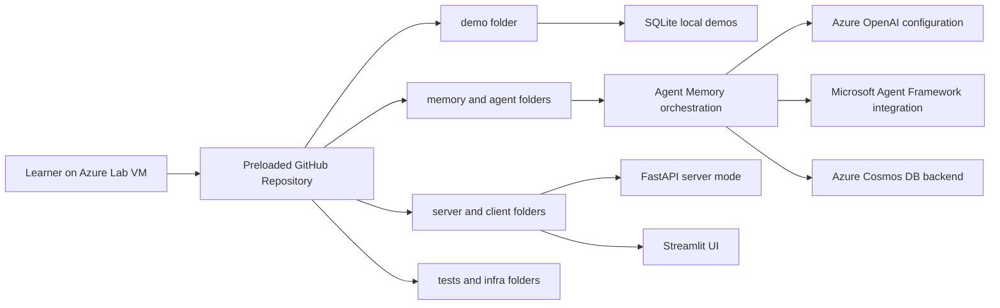

# Getting Started

## Scenario
In this lab, you will work on a preloaded Azure lab virtual machine to explore how Agent Memory adds persistent, searchable memory to Python-based agent applications across multiple sessions. The lab is grounded in the provided repository and the **Advanced Dynamic Memory Architecture - Agent Memory** TOC flow. You will begin with a local SQLite-backed implementation, move into Microsoft Agent Framework integration, extend persistence to Azure Cosmos DB, run the project in server mode with a user interface, validate the environment with tests, and finish with a production-oriented architecture review.

## Lab overview
This is an 8-hour Azure lab delivered on a single prepared VM. The repository is already available on the machine, along with Python tooling needed to run the project. Throughout the lab, you will inspect existing code rather than build a new app from scratch. You will sign in to Azure, confirm your environment, run the supplied demos, and compare how the same memory architecture behaves across local and cloud-backed backends.

The lab exercises progress in this order:

1. **Environment Setup & Local Memory** - verify the toolchain, review `.env` settings, install dependencies, and run the SQLite demo.
2. **Agent Framework Integration** - inspect and run the framework-based demos and compare retrieval patterns.
3. **Azure Cosmos DB Backend** - switch from local storage to cloud persistence and observe cross-run recall.
4. **Bounded Long-Term Memory & Insight Curation** - compare itemized and synthesized long-term memory strategies.
5. **Live Server Mode & Streamlit UI** - run the FastAPI server, test terminal chat, and launch the Streamlit experience.
6. **Validation, Testing & Troubleshooting** - run non-live and live checks, then diagnose common issues.
7. **Production Hardening & Architecture Review** - review authentication, infrastructure, and deployment considerations.

## Objectives
By the end of this lab, you will be able to:

- Sign in to the Azure portal and confirm the correct lab subscription and tenant.
- Locate and inspect the prepared repository on the lab VM.
- Verify Python, `uv`, and Git tooling before running the sample code.
- Understand how the repo is organized across `demo/`, `memory/`, `agent/`, `server/`, `client/`, `tests/`, and `infra/`.
- Follow the seven-exercise progression from local memory to production review.

## Prerequisites
Before starting, you should have:

- Basic Python experience
- Familiarity with running terminal commands
- General awareness of Azure OpenAI concepts
- Readiness to work from a pre-existing codebase instead of creating a new application from scratch

## Sign in to Azure
Use the lab-provided credentials to sign in to the Azure portal.

1. Open a browser on the lab VM and go to <https://portal.azure.com>.
2. Sign in with the following credentials:
   - Username: <inject key="AzureAdUserEmail"></inject>
   - Password: <inject key="AzureAdUserPassword"></inject>
3. If prompted to choose a tenant or subscription context, use:
   - Subscription: <inject key="SubscriptionID"></inject>
   - Tenant: <inject key="TenantID"></inject>
4. Keep the portal open for later exercises where you review Azure resources and configuration.

> [!Note]
> This lab uses an Azure lab environment. The Azure CLI sign-in flow in later exercises is based on `az login`, which opens a browser or falls back to device code flow according to Azure CLI behavior documented on Microsoft Learn.

## Prepared lab environment
The VM for this lab is already prepared for hands-on work.

- The project repository is preloaded on the lab machine.
- Python and `uv` are available for dependency management and execution.
- Git is available so you can inspect the repository state if needed.
- The workspace is intended for running the demos, tests, server mode, and UI flows described in the repo and TOC.

Use your deployment identifier when requested by the lab support flow:

- **Deployment ID: <inject key="DeploymentID" enableCopy="false"/>**

> [!Important]
> This lab guide assumes the repository and sample environment configuration have already been staged onto the VM by the deployment/bootstrap process. If a later exercise references a specific `.env` file or repo path, use the location provided in that exercise.

## Architecture
The lab architecture mirrors the supplied repository and the documented learning path.

### Components explained
- **Azure lab VM**: your working environment for the entire lab.
- **Preloaded repository**: the source of all demos, configuration examples, tests, and infrastructure references used in the exercises.
- **`demo/`**: contains the runnable learning path scripts, including local memory, framework integration, server mode, and Cosmos DB examples.
- **`memory/` and `agent/`**: contain the core memory orchestration and agent-related implementation patterns.
- **`server/` and `client/`**: support service-based execution and interactive access patterns.
- **SQLite**: the local starting backend used to demonstrate persistent memory behavior without requiring cloud persistence first.
- **Azure Cosmos DB**: the cloud persistence backend introduced later in the lab.
- **Azure OpenAI configuration**: supports the model-driven memory processing used by the repo.
- **Streamlit and FastAPI**: provide live interaction patterns for service-mode exploration.

## How to approach the lab
To get the most value from the exercises:

1. Start by orienting yourself to the repository structure before changing any settings.
2. Run the demos in order because each exercise builds on concepts introduced earlier.
3. Compare outputs carefully, especially when you move from SQLite to Cosmos DB or from direct memory usage to framework integration.
4. Keep notes on which files define configuration, hooks, and backend choices.
5. Use the Azure portal and terminal together when troubleshooting environment or resource-related issues.

## What you will do in the 7 exercises
### Exercise 1: Environment Setup & Local Memory
You will verify the installed tools, review environment variables, install dependencies with `uv`, and run `demo/01_basic_memory.py` to understand local memory behavior.

### Exercise 2: Agent Framework Integration
You will inspect `demo/02_agent_framework.py`, identify `context_providers=[memory]`, review hook usage, and compare that pattern with `demo/03_agent_driven.py` and `demo/06_insight_curation.py`.

### Exercise 3: Azure Cosmos DB Backend
You will review backend options, run the Cosmos DB demo, confirm persistence behavior, and compare backend trade-offs.

### Exercise 4: Bounded Long-Term Memory & Insight Curation
You will compare bounded itemized insights with more synthesized long-term memory behavior using the supplied demos.

### Exercise 5: Live Server Mode & Streamlit UI
You will start the FastAPI service, check the `/health` endpoint, run the terminal-based server mode demo, and launch the Streamlit UI.

### Exercise 6: Validation, Testing & Troubleshooting
You will run tests and validation checks, then work through common setup and configuration troubleshooting scenarios.

### Exercise 7: Production Hardening & Architecture Review
You will review production-focused concerns such as authentication, infrastructure, and how the repo would be adapted for more robust deployment patterns.

## Before you continue
Before moving to Exercise 1, make sure you can answer yes to all of the following:

- You have signed in to Azure with <inject key="AzureAdUserEmail"></inject>.
- You know your subscription is <inject key="SubscriptionID"></inject>.
- You know your tenant is <inject key="TenantID"></inject>.
- You understand that the repo is preloaded on the VM and will be explored in the next exercise.
- You are ready to use the deployment reference **<inject key="DeploymentID" enableCopy="false"/>** if support or troubleshooting steps require it.

## Summary
In this Getting Started page, you reviewed the scenario, confirmed the Azure sign-in details, understood the prepared VM-based environment, and saw how the seven exercises progress from local SQLite-backed memory to cloud persistence, server mode, testing, and production review. You are now ready to begin the first hands-on exercise and verify the development environment inside the preloaded repository.

## After publishing

> [!Note] These steps run **after** you push the template to CloudLabs — they verify CloudLabs can actually serve this lab guide to candidates.

- **Verify docs-proxy access:** open Templates → your template → **Lab Guide Settings** in <https://admin.cloudlabs.ai> and confirm CloudLabs can reach this repo via the docs proxy. If the repo is private, configure GitHub access at the template level.
- **Verify inline questions and inline validations:** sign in to <https://admin.cloudlabs.ai>, open your template, and walk through one full lab run to confirm every `<question>` and `<validation step="..."/>` renders correctly. Fix any that don't resolve.
